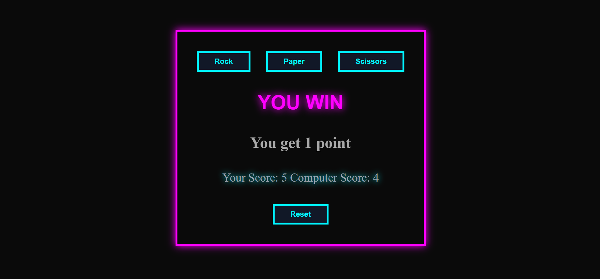

# Rock Paper Scissors

A browser based RPS game built with javascript, DOM manipulation, and event-driven programming.

## Preview

## Live Preview 

Link : https://byjayashree.github.io/odin-rockpaperscissors/

## Features

- Intaractive UI with buttons
- Score tracking
- Game ends when either player reaches 5 points
- Reset functionality
- Neon-themed interface 

## Personal Note

This is my first complete JavaScript project, and building it was a mix of learning, confusion, and small wins along the way. I explored a lot about JavaScript and DOM manipulation, and it was honestly surprising to realize that I had forgotten parts of HTML and CSS while focusing so much on JS.

That made me go back, revisit the basics, and rebuild my understanding before I could move forward. It was a bit frustrating at times, but also a really important part of the learning process.

Looking back, I’m happy with how far I’ve come and proud to have built my first complete frontend project. Thanks to Odin for guiding me through this journey.